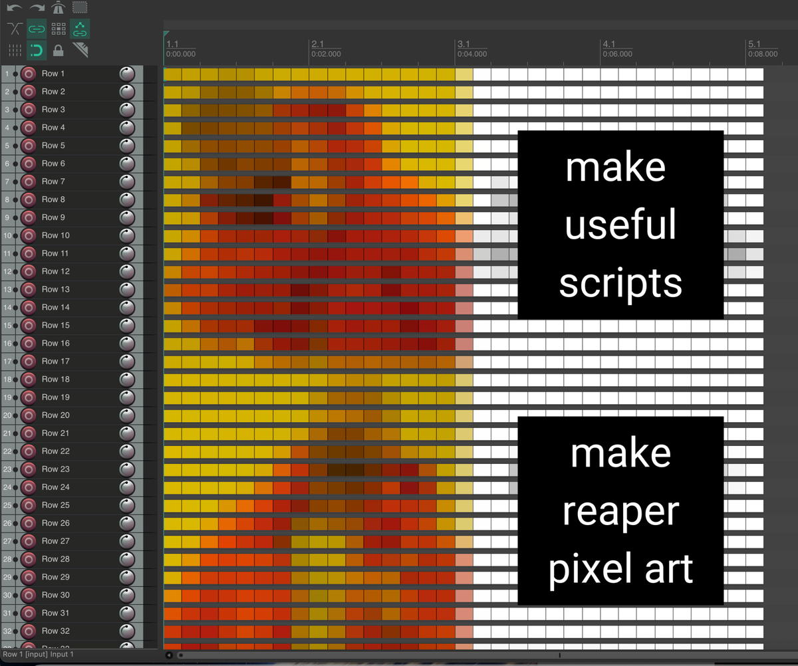
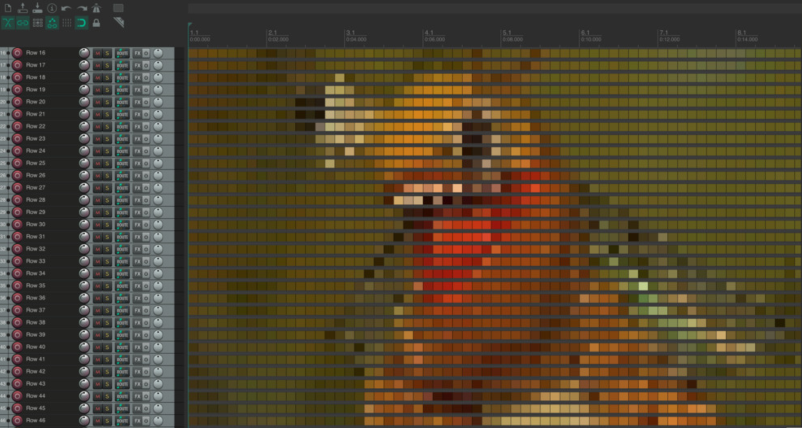

# Patch34: REAPER Pixel Art Generator

Turn any image into pixel art on the REAPER timeline. Each pixel becomes a colored media item.

**[→ Try it live](https://patch-34.github.io/reaper-pixel-art)**



## What it does

Upload a photo → tweak resolution and palette → download a `.lua` script → run it in REAPER → your image appears as colored items on the timeline.

Every pixel of the source image maps to a single media item with a custom color. Tracks are rows, items are columns. The script sets zoom so each pixel looks square.

## Features

- **Palettes**: Full RGB, NES (54 colors), CGA (16 colors), Game Boy (4 shades of green)
- **Resolution**: 8×8 to 128×128, auto-calculated width from image aspect ratio
- **Square pixels**: zoom adapts to your screen so items look perfectly square
- **Zero dependencies**: single HTML file, runs entirely in the browser
- **Cross-platform**: generated Lua scripts work on macOS and Windows

## How to use

1. Open [the generator](https://patch-34.github.io/reaper-pixel-art) in your browser
2. Drop an image, pick resolution and palette
3. Click **Generate** and download the `.lua` file
4. In REAPER: **Actions → Load ReaScript...** → select the file → **Run**

### Requirements

- **REAPER v6+**
- **js_ReaScriptAPI** — install via ReaPack for pixel-perfect square zoom. Without it, the script still works but zoom will be approximate.

To install js_ReaScriptAPI:
1. Install [ReaPack](https://reapack.com/) if you haven't
2. In REAPER: **Extensions → ReaPack → Browse packages**
3. Search for `js_ReaScriptAPI`, install, restart REAPER



## How it works

### Color handling

REAPER stores item colors as platform-dependent integers. Early versions manually packed RGB bytes (`R | G<<8 | B<<16`), which caused inverted colors on one platform because byte order differs between macOS and Windows.

The fix: `reaper.ColorToNative(r, g, b) | 0x1000000`. The API function handles byte order per platform, and the `0x1000000` flag tells REAPER to use the custom color.

### Square pixels

Making items look square was the hardest part. An item's visual width depends on its duration and the current horizontal zoom level. Track height depends on REAPER's internal settings, display scaling, and minimum track height limits.

The naive approach — hardcoding a zoom value — fails because:
- `adjustZoom()` doesn't use pixels-per-second as its unit
- `I_HEIGHTOVERRIDE = 10` doesn't mean the track is 10px tall (on Retina/HiDPI, REAPER clamps to a higher minimum like 25px)
- The relationship between zoom values and screen pixels varies by display

The solution reads actual dimensions at runtime:

```lua
-- Set minimum track height, then let REAPER recalculate
r.SetMediaTrackInfo_Value(tr, "I_HEIGHTOVERRIDE", 10)
-- ... unfreeze UI ...

-- Read what REAPER actually set (e.g. 25 on Retina)
local actual_h = r.GetMediaTrackInfo_Value(first_tr, "I_WNDH")

-- Get the Arrange view width in pixels
local arrange = r.JS_Window_FindChildByID(main_hwnd, 1000)
local _, arr_w, _ = r.JS_Window_GetClientSize(arrange)

-- Calculate zoom so each item = actual_h pixels wide
local visible_dur = (arr_w / actual_h) * ITEM_LEN
r.GetSet_ArrangeView2(0, true, 0, 0, 0, visible_dur)
```

This works on any screen because it measures real values instead of assuming them.

Note: zoom is set at generation time for the current window size. Resizing the REAPER window or changing monitors will break squareness — this is a fundamental limitation of how REAPER handles zoom.

## Files

| File | Description |
|------|-------------|
| `index.html` | Web generator (the whole app, single file) |
| `image_to_reaper_pixels.py` | CLI version for advanced users |
| `LICENSE` | MIT |

## Tech stack

- **Frontend**: Vanilla JS, Canvas API, single-file HTML
- **Scripting**: Lua (REAPER API)
- **Key APIs**: `reaper.ColorToNative`, `reaper.AddMediaItemToTrack`, `JS_Window_GetClientSize`, `GetSet_ArrangeView2`

## License

MIT

---

*Made by [Patch34](https://github.com/patch-34) as a "joke but real" tool.*
